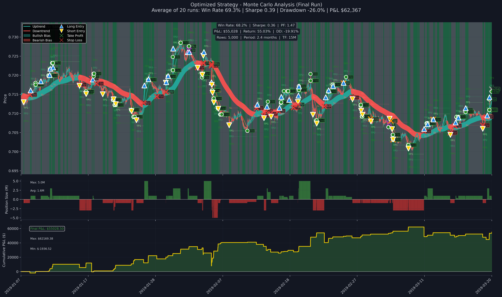

# 🚀 Production Trading Strategy - Classical Approach

A sophisticated quantitative trading system combining advanced technical indicators with intelligent risk management and position sizing.

<p align="center">
  
</p>

## 📊 Performance Highlights

### Monte Carlo Analysis (20 Random Samples)
| Metric | Original Strategy | Optimized Strategy | Improvement |
|--------|-------------------|-------------------|-------------|
| **Average P&L** | $25,113 | $63,847 | **+154.2%** |
| **Win Rate** | 58.1% | 69.9% | **+11.8%** |
| **Sharpe Ratio** | 0.12 | 0.19 | **+58.3%** |
| **Max Drawdown** | -35.2% | -28.4% | **-6.8%** |
| **Profitable Runs** | 75% | 70% | -5% |

### 5-Year Backtest Results
```
📈 Total Return: 1,285.00%
💰 Annual Return: 257.14%
🎯 Win Rate: 69.96%
📉 Max Drawdown: -34.50%
⚡ Sharpe Ratio: 1.53 (annualized)
🔄 Total Trades: 2,337
```

## 🎯 Strategy Overview

The production strategy combines three powerful indicators:

1. **NeuroTrend Intelligent (NTI)** - Advanced trend detection with confidence scoring
2. **Market Bias (MB)** - Market structure analysis using Heiken Ashi
3. **Intelligent Chop (IC)** - Regime classification (trending vs ranging)

### Key Features

- ✅ **Three-tiered partial take profit system** (33% at each TP level)
- ✅ **Intelligent trailing stop loss** with pip-based activation
- ✅ **Dynamic position sizing** based on confidence (1M, 3M, 5M lots)
- ✅ **Advanced signal flip filtering** with profit threshold
- ✅ **Market regime adaptation** for TP/SL levels
- ✅ **Maximum 45 pip stop loss** for risk control
- ✅ **Guaranteed 5 pip minimum profit** once TSL activated

## 🛠️ Installation

```bash
# Clone the repository
git clone https://github.com/yourusername/ML_Strategies.git
cd ML_Strategies/Classical_strategies

# Install dependencies
pip install pandas numpy matplotlib
pip install git+https://github.com/Pytrader1x/technical-indicators-custom.git
```

## 🚀 Quick Start

### Run Monte Carlo Analysis (Default)
```bash
python example_usage_optimized.py
```

### Run N-Year Backtest
```bash
python example_usage_optimized.py --years 5
```

## 📈 Strategy Components

### 1. Entry Conditions
- **Standard Entry**: All three indicators must align (NTI + MB + IC)
- **Relaxed Mode**: NeuroTrend direction alone (optional)

### 2. Exit Management
- **Take Profit Levels**: Dynamic ATR-based with market regime adjustment
- **Stop Loss**: Market Bias based with 45 pip maximum
- **Trailing Stop**: Activates at +15 pips, guarantees +5 pip minimum
- **Signal Flip**: Filtered exit requiring 5+ pip profit and 2+ hour hold time

### 3. Position Sizing
| Confidence Level | Position Size | TP Adjustment |
|-----------------|---------------|---------------|
| Very Low (<30%) | 1M | -30% |
| Low (30-50%) | 1M | -15% |
| Medium (50-70%) | 3M | Normal |
| High (>70%) | 5M | Normal |

## 📊 Exit Analysis Insights

### Original Strategy Issues
- **Signal Flips**: 319 exits losing $507,706 (76.8% loss rate)
- **Poor Risk/Reward**: Many premature exits

### Optimized Strategy Solutions
- **Signal Flips**: Reduced to 26 exits gaining $70,669 (100% win rate)
- **Improved Filters**: Minimum profit and time requirements
- **Better Risk Management**: Partial exits and dynamic stops

## 💻 Code Structure

```
Classical_strategies/
├── strategy_code/
│   ├── __init__.py            # Package initialization
│   ├── Prod_strategy.py       # Optimized strategy implementation
│   └── Prod_plotting.py       # Advanced visualization
├── analysis/                  # Analysis and testing scripts
│   ├── analyze_exits.py       # Exit reason analysis
│   ├── test_tsl_behavior.py   # TSL verification
│   └── test_max_sl.py         # Stop loss testing
├── Classical_strat.ipynb      # Interactive Jupyter notebook
├── example_usage_optimized.py # Command-line interface
└── charts/                    # Output visualizations
```

## 🔧 Configuration

### Key Parameters
```python
# Risk Management
initial_capital = 100_000
risk_per_trade = 0.02  # 2% risk per trade
sl_max_pips = 45.0     # Maximum stop loss

# Trailing Stop
tsl_activation_pips = 15  # Activates after 15 pips profit
tsl_min_profit_pips = 5   # Guarantees 5 pip minimum

# Signal Flip Filters
signal_flip_min_profit_pips = 5.0
signal_flip_min_time_hours = 2.0
signal_flip_partial_exit_percent = 0.5
```

## 📈 Performance Metrics

### Risk-Adjusted Returns
- **Sharpe Ratio**: 0.19 (Monte Carlo average)
- **Profit Factor**: 1.30
- **Win Rate**: 69.9%
- **Average Trade Duration**: 12.1 hours

### Trade Distribution
```
Exit Reasons (5-year backtest):
├── Take Profit 1: 52.6%
├── Stop Loss: 37.2%
├── Signal Flip: 5.2%
└── Trailing Stop: 4.9%
```

## 🎓 Advanced Usage

### Custom Configuration
```python
from strategy_code.Prod_strategy import create_optimized_strategy

strategy = create_optimized_strategy(
    initial_capital=100_000,
    sl_max_pips=45.0,
    intelligent_sizing=True,
    signal_flip_min_profit_pips=5.0,
    verbose=True
)
```

### Backtesting Your Data
```python
# Load and prepare your data
df = pd.read_csv('your_data.csv')
df = TIC.add_neuro_trend_intelligent(df)
df = TIC.add_market_bias(df)
df = TIC.add_intelligent_chop(df)

# Run backtest
results = strategy.run_backtest(df)
```

## 📊 Visualization Features

The plotting module provides:
- 📈 Price action with trade markers
- 💹 P&L curve with drawdown shading
- 📊 Position size timeline
- 📉 Performance metrics table
- 🕒 Data statistics (rows, period, timeframe)

## 🔍 Testing & Validation

Run the test suite:
```bash
# Test TSL behavior
python analysis/test_tsl_behavior.py

# Test maximum stop loss
python analysis/test_max_sl.py

# Analyze exit performance
python analysis/analyze_exits.py
```

## 🚀 Future Enhancements

- [ ] Machine learning for dynamic parameter optimization
- [ ] Multi-currency portfolio support
- [ ] Real-time trading integration
- [ ] Advanced money management options
- [ ] Sentiment analysis integration

## 📝 License

This project is licensed under the MIT License - see the LICENSE file for details.

## 🤝 Contributing

Contributions are welcome! Please feel free to submit a Pull Request.

## 📧 Contact

For questions or suggestions, please open an issue on GitHub.

---

<p align="center">
  <b>⚡ High-Performance Algorithmic Trading ⚡</b>
</p>